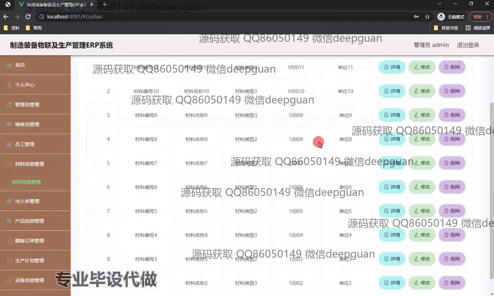
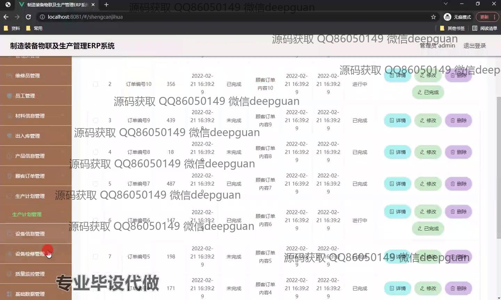

<h1 align="center">制造装备物联及生产管理ERP系统</h1>

## 简介
制造装备物联及生产管理ERP系统：角色包括管理员与用户，功能涵盖出入库管理、设备信息管理、员工管理、订单管理、生产计划调度和数据分析，支持设备状态监控和物联网技术，实现智能化生产管理。    --计算机毕业设计源码；毕设源码；java毕业设计源码

## 联系方式

<h3 align="center">获取完整代码与数据库文件 + 微信：deepguan QQ: 86050149 QQ群: 783742310</h3>

<h3 align="center">可帮忙远程部署 包运行成功！提供远程部署、修改代码、设计文档指导、代码讲解等服务！</h3>

## 功能介绍（完整见运行截图）
管理员：主要负责系统的整体管理和维护，包括用户角色管理、系统设置调整、模块配置等。在设备信息管理和出入库管理中，管理员能够添加、修改和删除设备和订单信息，以及查看详细数据以确保物料的有效管理。此外，管理员还可以进行生产计划的调度和员工信息的管理，通过数据分析和报告功能，提高企业的生产效率和资源配置。

员工：可以通过系统查看和更新其个人信息和工作安排，例如工作时间、部门职能、生产计划等。员工能够访问个人中心以管理其资料，查询和管理分配给他们的订单，同时该系统支持员工在生产管理过程中进行高效的信息输入和处理。借助系统提供的功能，员工还可以对设备状态进行监控，并参与设备的维护与检修。

生产调度员：主要负责生产计划的安排和调整，将生产任务分配给适当的员工，并且可以实时监控生产的进度，通过查看和分析生产数据以优化生产流程和提高设备利用率。他们能够查看订单的详细信息，更新订单状态，并在必要时进行计划调整以确保生产目标的实现。

维护/修理工：负责设备的维护和保养，使用系统记录设备检修历史和当前设备状态。系统支持他们查看设备检修管理模块，了解上次检修日期和设备状态，从而计划下一次维修活动，并通过详细检修记录提高设备的运营时间和可靠性。修理工还可以上报问题并协助解决，提高生产环节中设备的正常运作效率。

## 运行截图

本代码来源于网络,仅供学习参考使用!

